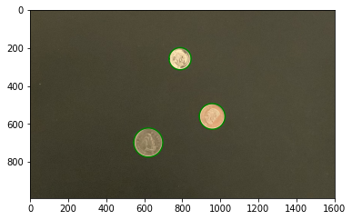
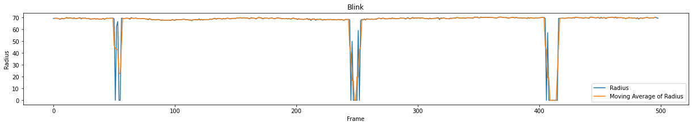

# RANSAC

This project is to find a circle model of the pupil using RANSAC. The circle 
model could be used to observe the radius, movement distances, and blinks. 
RANSAC stands for random sample consensus. RANSAC is based on fitting a 
model to only the inliers. Inliers are points that we want to fit into the 
model. Outliers are the points we don’t want to fit into the model. 
Thresholds include the number of iterations(the number of times the 
algorithm runs), error thresholds(the maximum distance a point can be from 
the model to be an inlier), and inlier percentages(the minimum percentage of 
points in the data that are inliers). Thresholds are made by the user by 
visualizing the distribution of the data. 

What are the steps of RANSAC:
1. Make thresholds for your model and the number of iterations
2. Choose random points from the data to initialize the model
3. Check if the model satisfies the inlier percentage. If yes, save
4. Repeat Steps 2 and 4 until you meet the maximum number of iterations
5. Return the best model

Robustness is when it is insensitive to noise and outliers. RANSAC is robust 
because it only considers the inliers of the models.

RANSAC can be used to make models that could be estimated by random sampling 
or points and have a measurable error. 

The circle model has three parameters. The length of the radius, and the x 
and y coordinates of the center. It has three methods. One to find the 
center and radius from three points, one to the compute error of a point 
from the model, and one to generate the model given the parameters.
Convert to greyscale, then binarize, then use edge detection, and then apply 
RANSAC.
Binarize to get better and cleaner edge detection. Choose a threshold that 
would only include the pupil.
A frame captures a blink if there is a large variation in the pupil radius. 

Blinks could be filtered when RANSAC is unable to make a model. False-
positive blinks could be filtered out by creating a graph of the moving 
average. A moving average would filter out false-positive blinks. 
